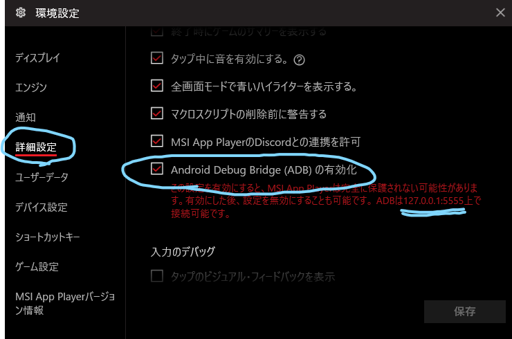
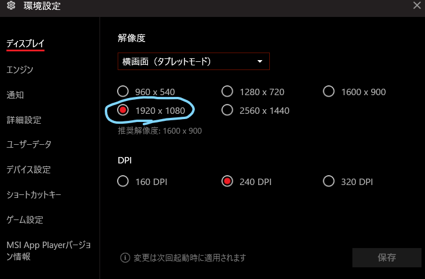
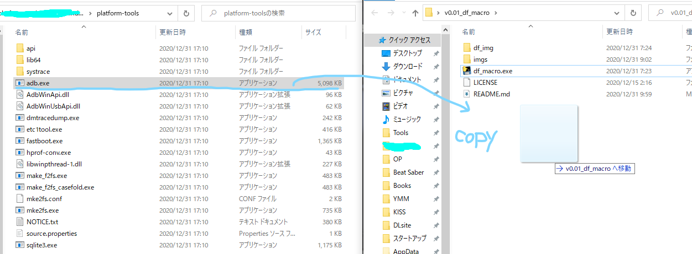
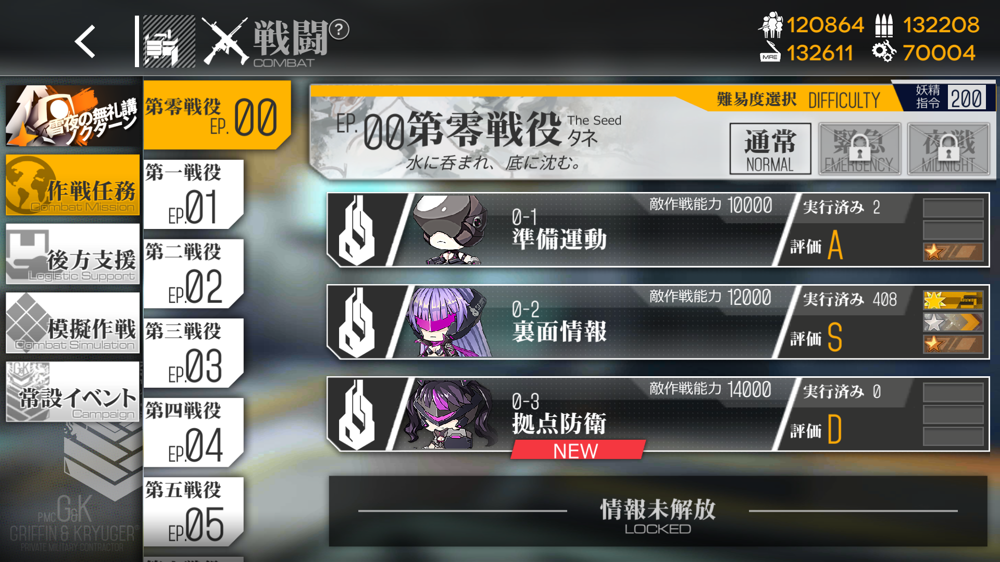
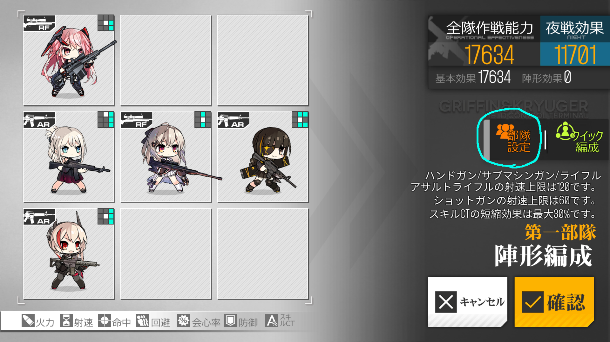
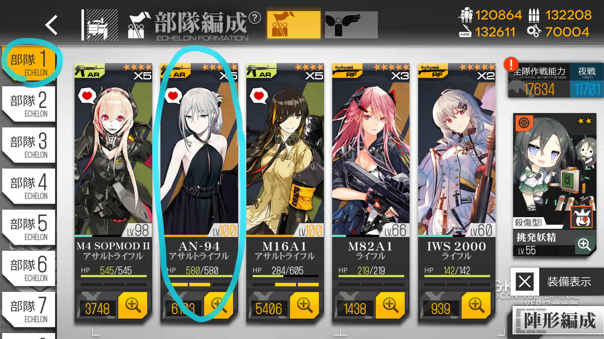
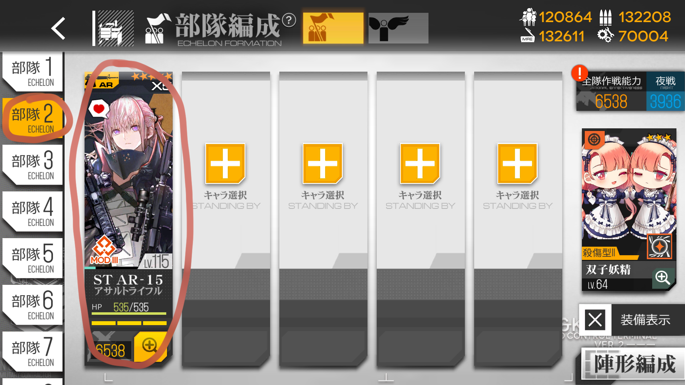

# どOふOまくろ。なの。

後方支援のポーリングと0-2周回ができるなの。  

これを使ってなにか問題が起きても悪いのはぷにぷにあたまのなてめぇなの。私は一切責任を負わないなの。  

# インストール方法。なの。  

このREADME.mdを読んでいるならもちろんバイナリファイルはダウンロードできてるなのね。  

まずは適当なアンドロイドエミュレータをインストールするなの。おすすめは [MSI APP PLAYER](https://www.msi.com/Landing/appplayer) と [BlueStacks](www.bluestacks.com) なの。 どちらもIntelとかMicrosoftあたりから支援金もらってるレベルには信頼できるから安心しろなの。 (てかどっちもBlueStacks製なの...)  

次にエミュレータになにかをインストールして動くことを確認するなの。当たり前なの。  

そしたらエミュレータの設定からADBの設定を見つけて有効にするなの。このときIP Addressが``127.0.0.1`` でポート番号が ``5555`` であることを確認しろなの。もしこの値でない場合はメモしておくなの。  



次いでに設定で解像度をHFD(1920x1080)にしておくなの。  

  

ついでに [SDK Platform-Tools](https://developer.android.com/studio/releases/platform-tools) もダウンロードしておくなの。Windows版を選んでダウンロードするなの。  

ダウンロードしたら解答して中にある ```adb.exe``` を ```df_macro.exe``` のあるフォルダにコピーしろなの。  



お疲れさまなの。  

# 後方支援のポーリングをする方法なの。

ホーム画面にしておくなのね。  

次に ```df_macro.exe``` をダブルクリックで起動するの。  

するとシェルが立ち上がってカスタムされたadb使うか？って聞いてくるから ``n`` を入力してエンターをおすなの。もし, ``nox`` を使っているなら ``nox_install_path/nox_adb.exe`` を渡せば動くはずなの。  

```
==========================
Use custom adb path ? (y or n) : n
```

次は adbサーバのアドレスが上でメモってっていったところで上の値と同じなら```y```をそうでないなら```n```を入力して次の欄にその値を入力するなの。  

```
==========================
Use custom ip address and port ? (y or n) : n
```

そんでここで ```0-2``` なのか ```kohoshien``` なのか聞いてくるから今回は ```kh``` って入力するなの

```
==========================
02 or kohoshien? (02 or kh) : kh
```

すると勝手に待ち受けてくれるなの。べんりなの。  

終了するときは ctrl + c をおすなの。  

# 0-2を周回する方法なのなの。

はじめに0-2に出撃しアタッカーに補給, 戦闘せずにもどるなの。そうすることで戦闘を選択した際に以下のように0-2が表示されるようにするなの。これやらないとバグるなの。



そしたら陣形編集から部隊設定に行って0-2用の陣形で部隊1に片方のアタッカーを割り当てたもの部隊2に残ったアタッカーものの設定を保存するなの。




陣形設定が終わったら部隊編成に行って部隊1に先ほどつくった設定1を割り当てて部隊2に**補給済み**の設定2のアタッカーを配置するの。 これ間違うとバグるから気を付けるなの。  





そしたら次に ```df_macro.exe``` を起動して指示をみて ```n``` or ```y``` を入力するの。  

そんで ```0-2``` なのか ```kohoshien``` なのか聞きかれたら今回は ```02``` って入力するなの

```
==========================
02 or kohoshien? (02 or kh) : 02
```

次はとりあえず ```1``` を入力しておけなの。 このオプションはサイクルがずれた時に部隊2から回す用なの。

```
==========================
補給したアタッカーを2部隊に配置しましたか？
周回開始時編成配置を入力してください
部隊1 -> 1, 部隊2 -> 2 :: 1
```

すると勝手に周回してくれるなの。べんりなの。  

終了するときは ctrl + c をおすなの。  

# License  

ライセンスは [LICENSE](https://github.com/Sachi854/AndroidEmuMacro/blob/master/LICENSE) をよめなの。MIT Licenseなの。

# どうでもいいはなし  

個人的には Do What The Fuck You Want To Public License がこの世の中で一番すきなの。 この適当さがたまらないなの。  

これをもし超絶エンジニアの先輩がコードも読んでくれて面倒見のいい超絶神な方ならぜひフィードバックをお願いしたいの...
